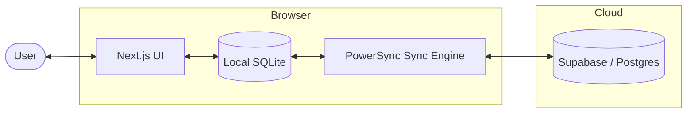

# Tasks.

A modern, offline-first task manager PWA. Manage tasks with subtasks, priorities, tags, and due dates — all with an optimistic UI that works offline.

## Features

- **Offline-First** — Reads/writes to local SQLite via [PowerSync](https://powersync.co/), syncs to Supabase in the background
- **PWA** — Installable, works fully offline with service worker caching
- **Optimistic UI** — All interactions update instantly with smooth animations, no jank
- **Cross-Device Sync** — Edits from any client (title, tags, priority, due date, state) reflect in real-time
- **Smart Filters** — Pill-based multi-select for state, priority, and tags
- **Subtasks** — Inline creation with optimistic rendering and stable sort order
- **Tags** — Create inline from cards, manage colors via palette picker dialog
- **Due Dates** — Color-coded overdue/today/countdown pills
- **Priorities** — Four levels with color indicators (Low → Blue, Medium → Amber, High → Orange, Urgent → Red)
- **Trash & Restore** — Soft-delete with locked editing, permanent delete, or restore
- **Responsive** — Masonry grid (1–3 columns), mobile header with overflow menu and FAB
- **Sync Indicator** — Status dot (green/amber/red) with upload/download icons and relative timestamps
- **Dark/Light Mode** — Full theme support
- **Auth Gate** — Supabase email/password authentication

## Tech Stack

- **Framework**: Next.js 16 (App Router)
- **Database/Sync**: PowerSync (Local SQLite) + Supabase (Cloud Postgres)
- **Auth**: Supabase Auth
- **Styling**: Tailwind CSS + Shadcn/UI + Lucide Icons
- **PWA**: Serwist

---

## Architecture



**How it works:**
1. The app reads/writes directly to a local SQLite database (via WASM in the browser)
2. PowerSync streams changes bidirectionally between local SQLite and Supabase Postgres
3. The service worker caches all app assets so the UI and database logic load without internet
4. CRUD uploads are throttled (2s debounce) to batch rapid edits into fewer network calls

---

## Setup

### 1. Supabase

1. Create a project at [supabase.com](https://supabase.com)
2. Note your **Project URL** and **Publishable API Key** from **Settings → API**
3. Run in **SQL Editor**:

```sql
CREATE TABLE public.tasks (
  id UUID PRIMARY KEY DEFAULT gen_random_uuid(),
  user_id UUID NOT NULL REFERENCES auth.users(id) ON DELETE CASCADE,
  parent_id UUID REFERENCES public.tasks(id) ON DELETE CASCADE,
  title TEXT,
  due_date TEXT,
  tags TEXT DEFAULT '[]',
  priority TEXT DEFAULT 'medium',
  state TEXT DEFAULT 'pending',
  created_at TIMESTAMPTZ DEFAULT now(),
  updated_at TIMESTAMPTZ DEFAULT now()
);

CREATE TABLE public.tags (
  id UUID PRIMARY KEY DEFAULT gen_random_uuid(),
  user_id UUID NOT NULL REFERENCES auth.users(id) ON DELETE CASCADE,
  name TEXT NOT NULL,
  color TEXT DEFAULT 'slate',
  created_at TIMESTAMPTZ DEFAULT now()
);

ALTER TABLE public.tasks ENABLE ROW LEVEL SECURITY;
ALTER TABLE public.tags ENABLE ROW LEVEL SECURITY;

CREATE POLICY "Users can CRUD own tasks" ON public.tasks
  FOR ALL USING (auth.uid() = user_id)
  WITH CHECK (auth.uid() = user_id);

CREATE POLICY "Users can CRUD own tags" ON public.tags
  FOR ALL USING (auth.uid() = user_id)
  WITH CHECK (auth.uid() = user_id);

CREATE PUBLICATION powersync FOR TABLE public.tasks, public.tags;
```

4. Go to **Authentication → Users → Add User** to create your account

5. **Prevent WAL storage buildup** — cap replication slot WAL retention so a disconnected PowerSync client can't fill the disk. Requires the [Supabase CLI](https://supabase.com/docs/guides/resources/supabase-cli):

   ```bash
   supabase --experimental \
     --project-ref <your-project-ref> \
     postgres-config update --config max_slot_wal_keep_size=256MB
   ```

### 2. PowerSync

1. Sign up at [powersync.com](https://www.powersync.com/)
2. Create an instance and connect it to your Supabase database
3. Configure sync streams:

```yaml
config:
  edition: 3
streams:
  user_data:
    auto_subscribe: true
    queries:
      - SELECT * FROM tasks WHERE tasks.user_id = auth.user_id()
      - SELECT * FROM tags WHERE tags.user_id = auth.user_id()
```

4. Note your **PowerSync Instance URL**

### 3. Local Development

```bash
npm install
```

Create `.env.local`:
```env
NEXT_PUBLIC_SUPABASE_URL=https://your-project.supabase.co
NEXT_PUBLIC_SUPABASE_PUBLISHABLE_KEY=eyJ...your-publishable-key
NEXT_PUBLIC_POWERSYNC_URL=https://your-instance.powersync.journeyapps.com
```

```bash
npm run dev          # Development
npm run build && npm run start  # Production (tests PWA/service worker)
```

### 4. Deploy to Vercel

1. Push to GitHub
2. Import at [vercel.com](https://vercel.com) → **Add New Project**
3. Add environment variables: `NEXT_PUBLIC_SUPABASE_URL`, `NEXT_PUBLIC_SUPABASE_PUBLISHABLE_KEY`, `NEXT_PUBLIC_POWERSYNC_URL`
4. Deploy

> Set your Supabase **Authentication → URL Configuration → Site URL** to your Vercel URL.

---

## Project Structure

| Path | Description |
|------|-------------|
| `src/app/page.tsx` | Dashboard with filters, pagination, and task grid |
| `src/app/login/page.tsx` | Login page |
| `src/app/layout.tsx` | Root layout with theme and PowerSync providers |
| `src/proxy.ts` | Auth middleware |
| `src/components/TaskCard.tsx` | Task card with inline editing, subtasks, tags, and optimistic state |
| `src/components/ManageTagsDialog.tsx` | Tag management dialog |
| `src/components/SyncIndicator.tsx` | Sync status indicator |
| `src/lib/powersync/AppSchema.ts` | SQLite schema definitions |
| `src/lib/powersync/SupabaseConnector.ts` | PowerSync ↔ Supabase connector |
| `src/lib/powersync/db.ts` | Database initialization and connection config |
