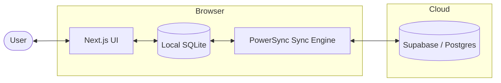

# Setup Guide

## Architecture



**How it works:**
1. The app reads/writes directly to a local SQLite database (via WASM in the browser)
2. PowerSync streams changes bidirectionally between local SQLite and Supabase Postgres
3. The service worker caches all app assets so the UI and database logic load without internet
4. CRUD uploads are debounced to batch rapid edits into fewer network calls while task, tracker, and notes views keep the UI responsive with optimistic or local-first state

---

## 1. Supabase

1. Create a project at [supabase.com](https://supabase.com)
2. Note your **Project URL** and **Publishable API Key** from **Settings → API**
3. Run this in the Supabase **SQL Editor**:

```sql
-- Tasks table
CREATE TABLE public.tasks (
  id UUID PRIMARY KEY DEFAULT gen_random_uuid(),
  user_id UUID NOT NULL REFERENCES auth.users(id) ON DELETE CASCADE,
  parent_id UUID REFERENCES public.tasks(id) ON DELETE CASCADE,
  title TEXT,
  due_date TEXT,
  tags TEXT DEFAULT '[]',
  priority TEXT DEFAULT 'medium',
  state TEXT DEFAULT 'pending',
  created_at TIMESTAMPTZ DEFAULT now(),
  updated_at TIMESTAMPTZ DEFAULT now()
);

-- Tags table
CREATE TABLE public.tags (
  id UUID PRIMARY KEY DEFAULT gen_random_uuid(),
  user_id UUID NOT NULL REFERENCES auth.users(id) ON DELETE CASCADE,
  name TEXT NOT NULL,
  color TEXT DEFAULT 'slate',
  created_at TIMESTAMPTZ DEFAULT now()
);

-- Time logs table (hourly time tracking blocks)
CREATE TABLE public.time_logs (
  id UUID PRIMARY KEY DEFAULT gen_random_uuid(),
  user_id UUID NOT NULL REFERENCES auth.users(id) ON DELETE CASCADE,
  activity_name TEXT NOT NULL,
  start_timestamp TIMESTAMPTZ NOT NULL,
  duration_minutes INTEGER NOT NULL DEFAULT 60,
  created_at TIMESTAMPTZ NOT NULL DEFAULT now(),
  UNIQUE (user_id, start_timestamp)
);

-- Activity types table (user-defined activity categories)
CREATE TABLE public.activity_types (
  id UUID PRIMARY KEY DEFAULT gen_random_uuid(),
  user_id UUID NOT NULL REFERENCES auth.users(id) ON DELETE CASCADE,
  name TEXT NOT NULL,
  color TEXT NOT NULL,
  created_at TIMESTAMPTZ NOT NULL DEFAULT now(),
  UNIQUE (user_id, name)
);

-- Daily ratings table (1-5 mood score per day)
CREATE TABLE public.daily_ratings (
  id UUID PRIMARY KEY DEFAULT gen_random_uuid(),
  user_id UUID NOT NULL REFERENCES auth.users(id) ON DELETE CASCADE,
  rating_date DATE NOT NULL,
  score SMALLINT NOT NULL CHECK (score >= 1 AND score <= 5),
  created_at TIMESTAMPTZ NOT NULL DEFAULT now(),
  UNIQUE (user_id, rating_date)
);

-- Notes pages table
CREATE TABLE public.pages (
  id UUID PRIMARY KEY DEFAULT gen_random_uuid(),
  user_id UUID NOT NULL REFERENCES auth.users(id) ON DELETE CASCADE,
  title TEXT NOT NULL,
  properties JSONB NOT NULL DEFAULT '{}'::jsonb,
  created_at TIMESTAMPTZ NOT NULL DEFAULT now(),
  updated_at TIMESTAMPTZ NOT NULL DEFAULT now()
);

-- Notes blocks table
CREATE TABLE public.blocks (
  id UUID PRIMARY KEY DEFAULT gen_random_uuid(),
  user_id UUID NOT NULL REFERENCES auth.users(id) ON DELETE CASCADE,
  page_id UUID NOT NULL REFERENCES public.pages(id) ON DELETE CASCADE,
  parent_block_id UUID REFERENCES public.blocks(id) ON DELETE CASCADE,
  type TEXT NOT NULL,
  content JSONB NOT NULL DEFAULT '{}'::jsonb,
  sort_rank TEXT NOT NULL,
  updated_at TIMESTAMPTZ NOT NULL DEFAULT now()
);

-- Notes graph edges table
CREATE TABLE public.edges (
  id UUID PRIMARY KEY DEFAULT gen_random_uuid(),
  source_block_id UUID NOT NULL REFERENCES public.blocks(id) ON DELETE CASCADE,
  target_id UUID NOT NULL,
  user_id UUID NOT NULL REFERENCES auth.users(id) ON DELETE CASCADE,
  type TEXT NOT NULL,
  UNIQUE (source_block_id, target_id, type)
);

-- Notes attachments table
CREATE TABLE public.attachments (
  id UUID PRIMARY KEY DEFAULT gen_random_uuid(),
  user_id UUID NOT NULL REFERENCES auth.users(id) ON DELETE CASCADE,
  page_id UUID REFERENCES public.pages(id) ON DELETE CASCADE,
  block_id UUID REFERENCES public.blocks(id) ON DELETE CASCADE,
  file_path TEXT NOT NULL,
  sync_state TEXT NOT NULL DEFAULT 'pending',
  CHECK (
    (page_id IS NOT NULL AND block_id IS NULL)
    OR (page_id IS NULL AND block_id IS NOT NULL)
  )
);

-- Row Level Security
ALTER TABLE public.tasks ENABLE ROW LEVEL SECURITY;
ALTER TABLE public.tags ENABLE ROW LEVEL SECURITY;
ALTER TABLE public.time_logs ENABLE ROW LEVEL SECURITY;
ALTER TABLE public.activity_types ENABLE ROW LEVEL SECURITY;
ALTER TABLE public.daily_ratings ENABLE ROW LEVEL SECURITY;
ALTER TABLE public.pages ENABLE ROW LEVEL SECURITY;
ALTER TABLE public.blocks ENABLE ROW LEVEL SECURITY;
ALTER TABLE public.edges ENABLE ROW LEVEL SECURITY;
ALTER TABLE public.attachments ENABLE ROW LEVEL SECURITY;

CREATE POLICY "Users can CRUD own tasks" ON public.tasks
  FOR ALL USING (auth.uid() = user_id)
  WITH CHECK (auth.uid() = user_id);

CREATE POLICY "Users can CRUD own tags" ON public.tags
  FOR ALL USING (auth.uid() = user_id)
  WITH CHECK (auth.uid() = user_id);

CREATE POLICY "Users can CRUD own time_logs" ON public.time_logs
  FOR ALL USING (auth.uid() = user_id)
  WITH CHECK (auth.uid() = user_id);

CREATE POLICY "Users can CRUD own activity_types" ON public.activity_types
  FOR ALL USING (auth.uid() = user_id)
  WITH CHECK (auth.uid() = user_id);

CREATE POLICY "Users can CRUD own daily_ratings" ON public.daily_ratings
  FOR ALL USING (auth.uid() = user_id)
  WITH CHECK (auth.uid() = user_id);

CREATE POLICY "Users can CRUD own pages" ON public.pages
  FOR ALL USING (auth.uid() = user_id)
  WITH CHECK (auth.uid() = user_id);

CREATE POLICY "Users can CRUD own blocks" ON public.blocks
  FOR ALL USING (auth.uid() = user_id)
  WITH CHECK (auth.uid() = user_id);

CREATE POLICY "Users can CRUD own edges" ON public.edges
  FOR ALL USING (auth.uid() = user_id)
  WITH CHECK (auth.uid() = user_id);

CREATE POLICY "Users can CRUD own attachments" ON public.attachments
  FOR ALL USING (auth.uid() = user_id)
  WITH CHECK (auth.uid() = user_id);

-- Indexes
CREATE INDEX idx_time_logs_user_start ON time_logs (user_id, start_timestamp);
CREATE INDEX idx_pages_user_title ON pages (user_id, title);
CREATE INDEX idx_blocks_page_sort_rank ON blocks (page_id, sort_rank);
CREATE INDEX idx_blocks_parent ON blocks (parent_block_id);
CREATE INDEX idx_edges_target_type ON edges (user_id, target_id, type);
CREATE INDEX idx_attachments_page ON attachments (page_id) WHERE page_id IS NOT NULL;
CREATE INDEX idx_attachments_block ON attachments (block_id) WHERE block_id IS NOT NULL;
CREATE INDEX idx_attachments_user_path ON attachments (user_id, file_path);

-- Publication for PowerSync replication
CREATE PUBLICATION powersync FOR TABLE public.tasks, public.tags, public.time_logs, public.activity_types, public.daily_ratings, public.pages, public.blocks, public.edges, public.attachments;
```

4. Go to **Authentication → Users → Add User** to create your account

5. **Prevent WAL storage buildup** — cap replication slot WAL retention so a disconnected PowerSync client can't fill the disk. Requires the [Supabase CLI](https://supabase.com/docs/guides/resources/supabase-cli):

   ```bash
   supabase --experimental \
     --project-ref <your-project-ref> \
     postgres-config update --config max_slot_wal_keep_size=1GB

   supabase --experimental \
     --project-ref <your-project-ref> \
     postgres-config update --config max_wal_size=1GB
   ```

## 2. PowerSync

1. Sign up at [powersync.com](https://www.powersync.com/)
2. Create an instance and connect it to your Supabase database
3. Configure sync streams:

```yaml
config:
  edition: 3
streams:
  user_data:
    auto_subscribe: true
    queries:
      - SELECT * FROM tasks WHERE tasks.user_id = auth.user_id()
      - SELECT * FROM tags WHERE tags.user_id = auth.user_id()
      - SELECT * FROM time_logs WHERE time_logs.user_id = auth.user_id()
      - SELECT * FROM activity_types WHERE activity_types.user_id = auth.user_id()
      - SELECT * FROM daily_ratings WHERE daily_ratings.user_id = auth.user_id()
      - SELECT * FROM pages WHERE pages.user_id = auth.user_id()
      - SELECT * FROM blocks WHERE blocks.user_id = auth.user_id()
      - SELECT * FROM edges WHERE edges.user_id = auth.user_id()
      - SELECT * FROM attachments WHERE attachments.user_id = auth.user_id()
```

4. Note your **PowerSync Instance URL**

This needs to stay aligned with the tables created in the Supabase SQL Editor. If you add or rename synced tables later, update both the publication and the PowerSync stream queries together.

Attachment ownership is explicit: each attachment belongs to either a page or a block. Use page-owned attachments for page-level assets like cover images, and block-owned attachments for embedded files inside note content.

## 3. Local Development

```bash
npm install
```

Copy `.env.example` to `.env.local` and fill in your values:

```env
NEXT_PUBLIC_SUPABASE_URL=https://your-project.supabase.co
NEXT_PUBLIC_SUPABASE_PUBLISHABLE_KEY=eyJ...your-publishable-key
NEXT_PUBLIC_POWERSYNC_URL=https://your-instance.powersync.journeyapps.com
NEXT_PUBLIC_ENABLE_LOG_VIEW=false
```

```bash
npm run dev
npm run build && npm run start
npm run lint
npm test
npm run test:dom
npx tsc --noEmit
```

Development notes:

- `npm run dev` and `npm run build` already use the repo's configured Webpack-based Next.js commands.
- The `/share` route is wired as the PWA web share target, so mobile share-sheet flows can be exercised locally after sign-in.
- Set `NEXT_PUBLIC_ENABLE_LOG_VIEW=true` to expose an in-app viewer for the latest 50 logger entries from the current browser session.

### Test layout

Vitest is split by environment:

- `npm test` runs the default node-based suites for pure logic and write-path behavior.
- `npm run test:dom` runs the jsdom-backed integration suites used for React hook and DOM-adjacent editor behavior.

- `tests/notes/` holds notes-specific tests.
- `tests/tasks/` holds task-specific tests.
- `tests/tracker/` holds tracker-specific tests.
- `tests/shared/` holds shared fixtures and assertion helpers used across app groups.

See [tests/README.md](tests/README.md) for the current suite-level breakdown.

Use `npm test` for a one-shot node run, `npm run test:dom` for the jsdom integration layer, and `npm run test:watch` while developing.

### Feature implementation notes

Keep feature structure aligned with the existing ownership split:

- Tasks logic lives in `src/app/tasks/page.tsx`, `src/components/tasks/`, and `src/lib/tasks/`.
- Tracker logic lives in `src/app/tracker/page.tsx`, `src/components/tracker/`, and `src/lib/tracker/`.
- Notes route-local UI lives in `src/components/notes/page/`, while block editor behavior stays alongside `src/components/notes/NoteBlockEditor.tsx` and `src/components/notes/NoteBlockEditorSlash.ts`.

For notes specifically, keep `src/app/notes/page.tsx` as the route orchestrator and move reusable route-local sections or hooks into `src/components/notes/page/` before expanding the route file.

If you change notes editing behavior, clipboard parsing, or block-merge semantics, keep the tests aligned with the intended visible-order editing rules and update the permanent project docs once that behavior is finalized.


If you change route wiring or editor behavior, validate with both `npm run lint` and `npx tsc --noEmit`.

If you update Tiptap packages, keep the versions aligned instead of mixing minor lines. The repo pins the Tiptap packages together so schema extensions resolve consistently.

## 4. Deploy to Vercel

1. Push to GitHub
2. Import at [vercel.com](https://vercel.com) → **Add New Project**
3. Add environment variables: `NEXT_PUBLIC_SUPABASE_URL`, `NEXT_PUBLIC_SUPABASE_PUBLISHABLE_KEY`, `NEXT_PUBLIC_POWERSYNC_URL`
4. Deploy

> Set your Supabase **Authentication → URL Configuration → Site URL** to your Vercel URL.

---

## Additional Documentation

- [README.md](README.md) — concise product overview and local quick start
- [docs/PROJECT_GUIDE.md](docs/PROJECT_GUIDE.md) — detailed project structure, app/component map, data flow, and implementation notes for future contributors or coding agents
