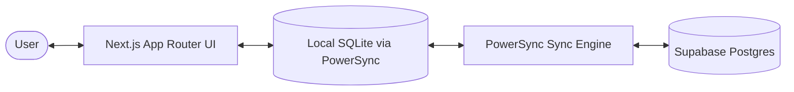

# Project Guide

This document is the best starting point for a developer or coding agent that needs to understand, modify, or debug Dash after coming back to the project later.

Use this together with:

- [README.md](../README.md) for product overview and quick start
- [SETUP.md](../SETUP.md) for environment setup, backend provisioning, and deployment

## What Dash Is

Dash is an offline-first Next.js application with three primary apps under one shell:

- `Tasks` — todo management with subtasks, tags, due dates, priorities, trash/restore, and share-target capture
- `Tracker` — time-block logging on a 7-day x 24-hour grid, daily mood ratings, yearly heatmaps, and weekly widgets
- `Notes` — a local-first PKM module built on pages, blocks, graph edges, and explicitly owned attachments

The app is designed so the browser-local database is the primary runtime source of truth. UI reads and writes happen against local SQLite through PowerSync, and cloud sync happens in the background.

## High-Level Architecture



Key runtime behavior:

1. The app boots the local PowerSync-backed SQLite database first.
2. Once local DB init completes, the UI renders from cached local data.
3. Cloud sync is connected in the background and should not block initial UI paint.
4. Many writes are debounced or optimistic so the interface stays responsive even when sync is behind.

## Root App Structure

### App Router shell

- `src/app/layout.tsx`
  - Root HTML shell
  - Mounts `ThemeProvider`, `PowerSyncProvider`, `RouteRestorer`, and Vercel analytics
  - Defines the global full-height app layout

- `src/components/powersync-provider.tsx`
  - Initializes local SQLite first with `initLocal()`
  - Only after local init succeeds does it render the app tree
  - Starts `connectCloud()` in the background so sync does not block the UI

- `src/components/RouteRestorer.tsx`
  - Stores the last non-login route in `localStorage`
  - If the app launches at `/`, it redirects back to the last route

### Shared shell components

- `src/components/AppHeader.tsx`
  - Shared sticky header used by app pages
  - Renders differently on mobile and desktop
  - Handles theme toggle, sync indicator, logout, and mobile overflow menu

- `src/components/AppSwitcher.tsx`
  - App-to-app switcher used in the shell
  - Uses the registry in `src/lib/apps.ts`
  - Prefetches other app routes for faster handoff

- `src/components/MobileBottomFabs.tsx`
  - Shared mobile bottom shell used by tasks and tracker
  - Holds the app switcher plus app-specific primary actions

- `src/components/SyncIndicator.tsx`
  - Displays PowerSync connection/upload/download state
  - Used in the header so sync state is always visible

### Route-level loading behavior

- `src/app/tasks/loading.tsx`
  - Route-level fallback for navigation into tasks
  - Uses the real header shell plus tasks-specific skeleton content

- `src/app/tracker/loading.tsx`
  - Route-level fallback for navigation into tracker
  - Uses the real header shell plus tracker tab/body skeletons

Important convention:

- The header is treated as stable app chrome, not data-dependent content.
- Loading UI should generally appear below the real header when possible.

## Directory Map

### Routes

- `src/app/page.tsx` — launcher/start page
- `src/app/login/page.tsx` — login page
- `src/app/share/page.tsx` — PWA share target review and save flow
- `src/app/tasks/page.tsx` — tasks dashboard
- `src/app/tracker/page.tsx` — tracker dashboard
- `src/app/notes/page.tsx` — notes dashboard shell

### Shared components

- `src/components/AppHeader.tsx`
- `src/components/AppSwitcher.tsx`
- `src/components/MobileBottomFabs.tsx`
- `src/components/SyncIndicator.tsx`
- `src/components/LogViewerDialog.tsx`
- `src/components/ManageNamedColorItemsDialog.tsx`

### Task-specific components

- `src/components/tasks/TaskCard.tsx`
- `src/components/tasks/TaskMetadataEditor.tsx`
- `src/components/tasks/ManageTagsDialog.tsx`
- `src/components/tasks/TasksPageSkeleton.tsx`

### Tracker-specific components

- `src/components/tracker/ActivityToolbar.tsx`
- `src/components/tracker/TimeGrid.tsx`
- `src/components/tracker/WeekNavigator.tsx`
- `src/components/tracker/WeekViewSkeleton.tsx`
- `src/components/tracker/YearActivityGrid.tsx`
- `src/components/tracker/YearRatingGrid.tsx`
- `src/components/tracker/ManageActivitiesDialog.tsx`
- `src/components/tracker/widgets/*`

### Shared libraries

- `src/lib/apps.ts` — app registry used by header/switcher/FAB shell
- `src/lib/auth.ts` — current-user lookup with session caching
- `src/lib/colors.ts` — tag palette and class maps
- `src/lib/activities.ts` — tracker activity palette and class maps
- `src/lib/tasks.ts` — priority and due-date helpers
- `src/lib/share.ts` — parsing incoming share payloads and title generation
- `src/lib/debounced-update.ts` — debounced local writes and execute batching
- `src/lib/logger.ts` — runtime logging abstraction
- `src/hooks/use-notes.ts` — local SQLite query hooks for note pages and blocks

### PowerSync integration

- `src/lib/powersync/AppSchema.ts` — local schema definition
- `src/lib/powersync/db.ts` — database instance, init, connect, reconnect, reset
- `src/lib/powersync/SupabaseConnector.ts` — sync connector implementation

### Notes app structure

Primary route:

- `src/app/notes/page.tsx`

Current responsibilities:

- Registers the notes module in the shared shell and launcher
- Reads note page counts and recent pages from local SQLite
- Uses `src/hooks/use-notes.ts` for the first page/block local query helpers
- Preserves the shared header-first loading model used by tasks and tracker
- Notes blocks carry `updated_at` so editor-heavy writes can adopt the existing debounced local update patterns cleanly

Notes attachment ownership:

- attachments are owned by either a page or a block, never both
- page-owned attachments cover page-level assets such as cover images stored in page properties
- block-owned attachments cover inline embedded assets rendered by the editor

## Tasks App Structure

Primary route:

- `src/app/tasks/page.tsx`

Responsibilities:

- Runs the main task list query and tag filter query from local SQLite
- Maintains local UI filter state for task state, priority, tag filters, and pagination
- Keeps optimistic draft tasks in memory before they are persisted
- Renders the shared header plus a tasks-specific filter row
- Uses `TaskCard` for task editing and subtask management
- Uses `ManageTagsDialog` for tag CRUD
- Uses `MobileBottomFabs` for the floating add action on mobile

Important child components:

- `src/components/tasks/TaskCard.tsx`
  - Owns inline task editing behavior
  - Handles title, priority, due date, tags, state changes, and subtasks
  - Uses `debouncedUpdate()` for merged updates
  - Uses optimistic local state for deletes and subtasks

- `src/components/tasks/TaskMetadataEditor.tsx`
  - Shared due-date and tag picker row
  - Used inside both task editing and the `/share` task creation flow

- `src/components/tasks/ManageTagsDialog.tsx`
  - Thin wrapper around the shared named-color CRUD dialog
  - Tags persistence still uses the tags helper in `src/lib/tags.ts`

- `src/components/tasks/TasksPageSkeleton.tsx`
  - Shared loading primitives for tasks route fallback and in-page loading state

Tasks page loading model:

- Route navigation into `/tasks` uses `src/app/tasks/loading.tsx`
- In-page initial query loading uses `TasksFilterRowSkeleton` and `TasksContentSkeleton`
- The header remains real chrome instead of being skeletonized

## Tracker App Structure

Primary route:

- `src/app/tracker/page.tsx`

Responsibilities:

- Loads activity types, time logs, and daily ratings from local SQLite
- Manages three tracker views: `week`, `activity`, and `mood`
- Keeps optimistic in-memory overlays for time log and rating changes
- Uses URL search params for the active tracker subview (`?view=...`)
- Renders the shared header and a tracker-specific tab strip
- Uses `ManageActivitiesDialog` for activity CRUD

Important child components:

- `src/components/tracker/ActivityToolbar.tsx`
  - Activity selection row for painting the week grid

- `src/components/tracker/TimeGrid.tsx`
  - Main 7-day x 24-hour time grid
  - Clicking a cell writes or clears a time log entry

- `src/components/tracker/WeekNavigator.tsx`
  - Desktop header navigator plus mobile FAB navigator

- `src/components/tracker/WeekViewSkeleton.tsx`
  - Shared skeleton for the week view body

- `src/components/tracker/YearActivityGrid.tsx`
  - Year heatmap for tracked activity

- `src/components/tracker/YearRatingGrid.tsx`
  - Year calendar heatmap for daily mood ratings

- `src/components/tracker/ManageActivitiesDialog.tsx`
  - Thin wrapper around the shared named-color CRUD dialog

- `src/components/tracker/widgets/*`
  - Weekly analytics and summaries used below the grid

Tracker loading model:

- Route navigation into `/tracker` uses `src/app/tracker/loading.tsx`
- Within the page, `loadingActivities || loadingLogs` shows `WeekViewSkeleton` for the week view body
- The shared header remains real chrome during route loading

## Shared Named-Color CRUD Pattern

The tag and activity management dialogs now share one reusable primitive:

- `src/components/ManageNamedColorItemsDialog.tsx`

This component owns:

- dialog open behavior
- create input and color picker UI
- optimistic create overlays
- optimistic color updates
- reconciliation between optimistic and persisted rows

It is wrapped by:

- `src/components/tasks/ManageTagsDialog.tsx`
- `src/components/tracker/ManageActivitiesDialog.tsx`

If one of these dialogs breaks, start with the shared component first.

## Share Flow

Route:

- `src/app/share/page.tsx`

This route is the PWA web share target. It:

- reads incoming share params with helpers from `src/lib/share.ts`
- builds an initial task title from the payload
- reuses `TaskMetadataEditor` for due date and tags
- inserts a task directly into local SQLite and then routes the user back to `/tasks`

## Data And Write Flow

### Read path

- UI components use `useQuery()` from `@powersync/react`
- Queries read from local SQLite, not directly from Supabase
- This keeps the UI fast and available offline

### Write path

There are three common write patterns:

1. Direct local execute
   - Used when the action should persist immediately
   - Example: some direct inserts/deletes via `db.execute()`

2. Debounced field updates
   - Implemented in `src/lib/debounced-update.ts`
   - Used when rapid repeated edits should merge into one update
   - Especially important for task editing

3. Debounced execute batching
   - Also implemented in `src/lib/debounced-update.ts`
   - Used for insert-like or one-shot writes that should batch and dedupe

Important implementation notes:

- Pending updates are keyed by `table:id`, not just `id`
- `flushAllUpdates()` flushes queued executes before updates
- `tasks` is the only table currently treated as having `updated_at`

## Auth And User Context

- `src/lib/auth.ts` exposes `getCurrentUserId()`
- Many create flows fetch the user id before local writes
- `src/components/AppHeader.tsx` handles logout through Supabase client auth

## App Registry And Visual Identity

- `src/lib/apps.ts` is the central registry for each app's route, name, icon, and accent colors
- The header, switcher, and mobile FAB shell all rely on this registry
- If a new app is added, start there first

The `Notes` module follows that same pattern, so future work should extend the shared shell instead of introducing notes-specific chrome.

## PowerSync Notes

- `src/components/powersync-provider.tsx` intentionally waits only for local init before rendering the app
- Cloud sync happens after the app is already usable
- `src/lib/powersync/db.ts` exposes `initLocal()`, `connectCloud()`, `reconnectCloud()`, and `resetLocalDatabase()`

This is one of the most important architectural choices in the codebase:

- local DB ready == UI may render
- cloud connected != required for first paint

## Useful Working Notes For Future Agents

If you are debugging behavior in this repo, start from the narrowest owning surface:

- navigation or app shell issues: `AppHeader`, `AppSwitcher`, `MobileBottomFabs`, route `loading.tsx`
- tasks editing issues: `TaskCard.tsx`, `TaskMetadataEditor.tsx`, `debounced-update.ts`
- tag/activity dialog issues: `ManageNamedColorItemsDialog.tsx` first, then the wrapper dialog file
- tracker week grid behavior: `tracker/page.tsx`, `TimeGrid.tsx`, `ActivityToolbar.tsx`
- sync/bootstrap issues: `powersync-provider.tsx`, `src/lib/powersync/db.ts`, `SupabaseConnector.ts`

A few repo-specific patterns matter repeatedly:

- Many views use optimistic local state on top of PowerSync query data.
- Route loading uses real header chrome where possible and skeletonizes only the content below it.
- Mobile dialogs launched from overflow menus are opened outside the dropdown subtree to avoid key input problems.
- The app intentionally favors local responsiveness over immediate cloud confirmation.

## Common Validation Commands

```bash
npm run dev
npm run lint
npx tsc --noEmit
```

## When To Update This Document

Update this guide when any of the following changes:

- a route gets a major structural rewrite
- shared shell behavior changes
- data flow or sync behavior changes
- a reusable component becomes the main owner of a workflow
- optimistic update or loading-state patterns change